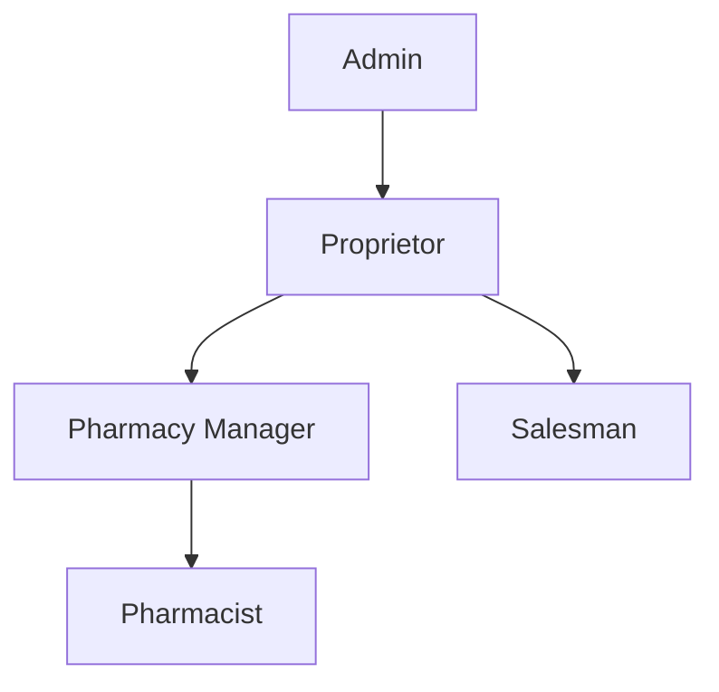

# Role-Based Access Control (RBAC) System

## Overview

PharmacyHub implements a comprehensive Role-Based Access Control (RBAC) system that provides fine-grained access control through a combination of roles, permissions, and groups. The system supports role hierarchy, permission inheritance, and group-based access management.

## Core Components

### 1. Permissions
- Atomic units of access control
- Defined by resource type and operation type
- Can require approval for sensitive operations
- Support conditional access through JSON-based rules

### 2. Roles
- Collections of permissions
- Support hierarchical relationships
- Have precedence levels
- Can be system-defined or custom

### 3. Groups
- Collections of roles
- Simplify role assignment
- Enable organizational structure mapping
- Support bulk permission management

## Role Hierarchy

The system implements a hierarchical role structure with the following characteristics:



### Precedence Levels
1. Admin (0) - Highest precedence
2. Proprietor (1)
3. Pharmacy Manager (2)
4. Pharmacist (3)
5. Salesman (4)

## Permission Structure

Permissions are structured as combinations of:

1. Resource Types:
   - PHARMACIST
   - PHARMACY_MANAGER
   - PROPRIETOR
   - SALESMAN
   - INVENTORY
   - PRESCRIPTION
   - ORDER
   - CONNECTION
   - ROLE
   - GROUP
   - AUDIT_LOG
   - SYSTEM_SETTING

2. Operation Types:
   - CREATE
   - READ
   - UPDATE
   - DELETE
   - APPROVE
   - REJECT
   - MANAGE
   - EXPORT
   - IMPORT
   - VIEW_ALL
   - VIEW_OWN

## Default Role Configuration

### Admin Role
- Full system access
- Can manage roles and permissions
- Can view audit logs
- Can manage system settings

### Proprietor Role
- View all branches
- Manage branches
- View financial reports
- Manage pharmacy managers

### Pharmacy Manager Role
- Manage inventory
- View sales reports
- Manage staff
- Oversee pharmacists

### Pharmacist Role
- View pharmacy inventory
- Manage prescriptions
- View patient history
- Handle medication dispensing

### Salesman Role
- Create orders
- View orders
- Update order status
- Manage customer relationships

## Security Features

1. Permission Evaluation
   - Method-level security using @RequiresPermission
   - URL-based security through SecurityConfig
   - Custom permission evaluator for complex rules

2. Audit Logging
   - Tracks all RBAC-related actions
   - Records user, action, timestamp
   - Supports audit trail review

3. Caching
   - Caches user permissions
   - Caches role hierarchies
   - Improves performance

## Implementation Details

### 1. Permission Checks
```java
@RequiresPermission(resource = "INVENTORY", operation = "MANAGE")
public void updateInventory(InventoryDTO dto) {
    // Implementation
}
```

### 2. Role Assignment
```java
rbacService.assignRoleToUser(userId, roleId);
```

### 3. Group Management
```java
rbacService.assignGroupToUser(userId, groupId);
```

## Best Practices

1. Role Assignment
   - Follow principle of least privilege
   - Use groups for organizational units
   - Regularly review role assignments

2. Permission Management
   - Keep permissions atomic
   - Use role hierarchy for inheritance
   - Document permission combinations

3. Security Considerations
   - Validate role assignments
   - Check circular dependencies
   - Maintain audit logs

## API Endpoints

### Role Management
```
POST    /api/rbac/roles
GET     /api/rbac/roles
PUT     /api/rbac/roles/{id}
DELETE  /api/rbac/roles/{id}
```

### Permission Management
```
POST    /api/rbac/permissions
GET     /api/rbac/permissions
PUT     /api/rbac/permissions/{id}
DELETE  /api/rbac/permissions/{id}
```

### Group Management
```
POST    /api/rbac/groups
GET     /api/rbac/groups
PUT     /api/rbac/groups/{id}
DELETE  /api/rbac/groups/{id}
```

### Role Hierarchy
```
POST    /api/rbac/roles/hierarchy/{parentRoleId}/children/{childRoleId}
DELETE  /api/rbac/roles/hierarchy/{parentRoleId}/children/{childRoleId}
GET     /api/rbac/roles/hierarchy/{roleId}/children
GET     /api/rbac/roles/hierarchy/precedence
```

## Error Handling

The system defines specific error codes for RBAC operations:

- RBAC_001: Permission denied
- RBAC_002: Invalid role hierarchy
- RBAC_003: Entity not found
- RBAC_004: Invalid operation

## Configuration

### Cache Configuration
```java
@EnableCaching
public class RBACCacheConfig {
    // Cache configurations for permissions and roles
}
```

### Security Configuration
```java
@EnableMethodSecurity
public class SecurityConfig {
    // Security configurations for RBAC
}
```

## Migration Guide

When upgrading or modifying the RBAC system:

1. Back up existing role assignments
2. Update permission definitions
3. Migrate role hierarchies
4. Verify group memberships
5. Test permission evaluations

## Troubleshooting

Common issues and solutions:

1. Permission Denied
   - Check role assignments
   - Verify permission definitions
   - Review role hierarchy

2. Circular Dependencies
   - Review role relationships
   - Check inheritance chains
   - Validate role assignments

3. Performance Issues
   - Review cache configuration
   - Check permission evaluations
   - Optimize role hierarchy