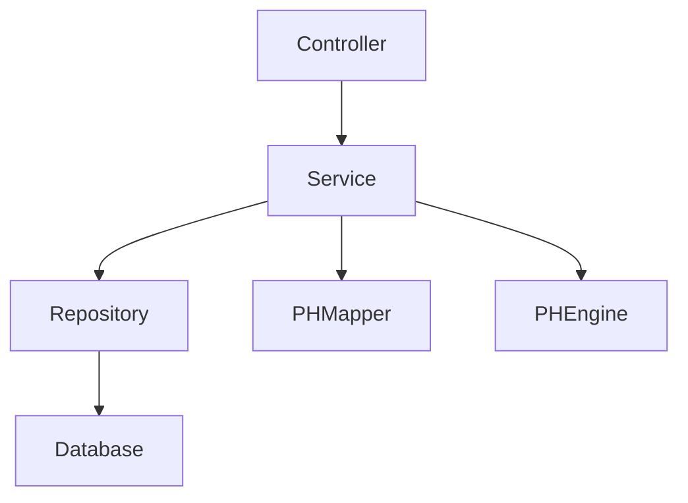

# Core Architecture

## Overview

PharmacyHub backend follows a layered architecture pattern with clear separation of concerns. This document outlines the core architectural components and their interactions.

## Architectural Layers

### 1. Presentation Layer (Controllers)
- Located in `com.pharmacyhub.controller`
- Handles HTTP requests and responses
- Implements REST endpoints
- Manages request validation
- Handles response formatting

### 2. Business Layer (Services)
- Located in `com.pharmacyhub.service`
- Implements business logic
- Manages transactions
- Handles data transformation
- Implements business rules

### 3. Data Access Layer (Repositories)
- Located in `com.pharmacyhub.repository`
- Manages database operations
- Implements data access patterns
- Handles database transactions
- Manages entity relationships

### 4. Domain Layer (Entities)
- Located in `com.pharmacyhub.entity`
- Defines domain models
- Implements business rules
- Manages entity relationships
- Defines domain constraints

## Core Components

### PHEngine
```java
@Component
public class PHEngine {
    public User getLoggedInUser() {
        UserDetails userDetails = (UserDetails) SecurityContextHolder
            .getContext()
            .getAuthentication()
            .getPrincipal();
        return (User) userDetails;
    }
}
```

### PHMapper
```java
@Component
public class PHMapper {
    private ModelMapper modelMapper = new ModelMapper();
    
    // DTO to Entity mapping methods
    public User getUser(UserDTO userDTO) {
        return modelMapper.map(userDTO, User.class);
    }
    
    // Entity to DTO mapping methods
    public UserDTO getUserDTO(User user) {
        return modelMapper.map(user, UserDTO.class);
    }
}
```

## Component Interactions



## Key Design Decisions

1. **Base Engine Pattern**
   - All services extend PHEngine
   - Provides common functionality
   - Centralizes cross-cutting concerns

2. **Mapper Pattern**
   - Centralized mapping through PHMapper
   - Consistent DTO-Entity conversion
   - Clear transformation rules

3. **Repository Pattern**
   - Interface-based repositories
   - Spring Data JPA implementation
   - Clean data access separation

4. **Service Pattern**
   - Interface-based service definitions
   - Clear business logic separation
   - Transaction management

## Code Organization

```
com.pharmacyhub/
├── config/           # Configuration classes
├── constants/        # Enums and constants
├── controller/       # REST controllers
├── dto/             # Data transfer objects
├── engine/          # Core engine components
├── entity/          # Domain entities
├── repository/      # Data access layer
├── security/        # Security components
├── service/         # Business logic
└── util/            # Utility classes
```

## Configuration Management

- Application properties in `application.yml`
- Environment-specific configurations
- Security configurations
- Database configurations

## Cross-Cutting Concerns

1. **Security**
   - JWT authentication
   - Role-based authorization
   - Security filters

2. **Logging**
   - Centralized logging
   - Log levels
   - Log formatting

3. **Exception Handling**
   - Global exception handler
   - Custom exceptions
   - Error responses

4. **Validation**
   - Input validation
   - Business rule validation
   - Cross-field validation

## Best Practices

1. **Code Organization**
   - Follow package structure
   - Maintain separation of concerns
   - Use proper naming conventions

2. **Error Handling**
   - Use custom exceptions
   - Implement proper logging
   - Return appropriate responses

3. **Security**
   - Implement proper authentication
   - Use authorization
   - Follow security best practices

4. **Testing**
   - Write unit tests
   - Implement integration tests
   - Follow testing best practices